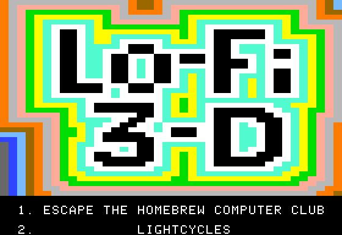
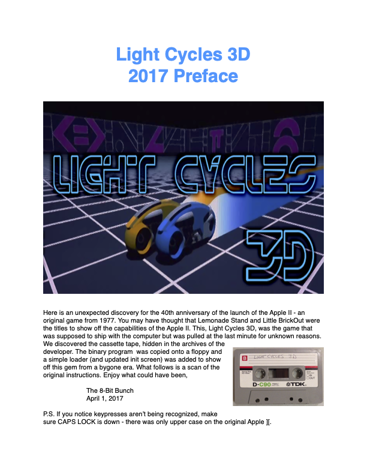
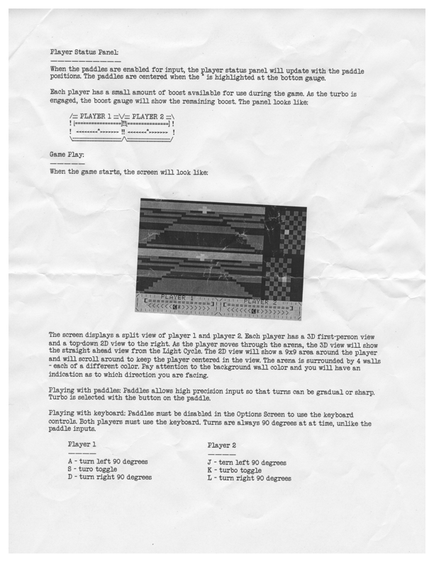
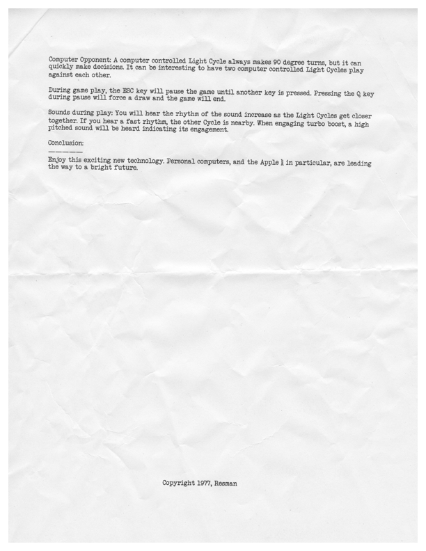

# Lo-Fi 3D

[140K LOFI3D Disk Image](LOFI3D.po)

## Escape from the Homebrew Computer Club

    ESCAPE FROM THE HOMEBREW COMPUTER CLUB
        WHO:	STEVE WOZNIAK A.K.A. WOZ
        WHEN:	EVENING, FEBRUARY 16, 1977
        WHERE:	BASEMENT OF BUILDING, STANFORD CAMPUS
        STATUS:	YOU	(WOZ) HAVE JUST
                DEMONSTRATED YOUR LATEST CREATION,
                THE APPLE ][ TO THE HOMEBREW COMPUTER
                CLUB. HOWEVER, THE EVIL MINIONS OF
                TANDY, ATARI, AND COMMODORE HAVE
                PLOTTED TO STEAL THE COMPUTER FROM YOU
                AS YOU LEAVE THE MEETING. YOU MUST
                ESCAPE THE BUILDING AND JOIN STEVE JOBS
                TO ENSURE YOUR COMPUTER GETS TO MARKET.

## LightCycles 3D 2017 Preface

2017 Preface:

Original Release: 

