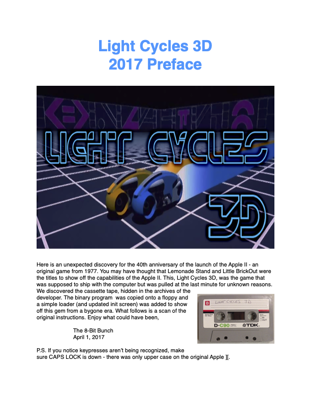

# Lo-Fi 3D

## Escape from the Homebrew Computer Club

            ESCAPE		FROM	THE		HOMEBREW	COMPUTER	CLUB
				WHO:	STEVE	WOZNIAK	A.K.A.	WOZ
				WHEN:	EVENING,	FEBRUARY	16,	1977
				WHERE:	BASEMENT	OF	BUILDING, STANFORD	CAMPUS
				STATUS:	YOU	(WOZ)	HAVE	JUST
                        DEMONSTRATED	YOUR	LATEST	CREATION,
                        THE	APPLE	][ TO	THE	HOMEBREW	COMPUTER
                        CLUB.	HOWEVER,	THE	EVIL	MINIONS	OF
                        TANDY,	ATARI,	AND	COMMODORE	HAVE
                        PLOTTED	TO	STEAL	THE	COMPUTER	FROM	YOU
                        AS	YOU	LEAVE	THE	MEETING.	YOU	MUST
                        ESCAPE	THE	BUILDING	AND	JOIN	STEVE	JOBS
                        TO	ENSURE	YOUR	COMPUTER	GETS	TO	MARKET.

## LightCycles 3D 2017 Preface

Here is an unexpected discovery for the 40th anniversary of the launch of the Apple II - an original game from 1977. You may have thought that Lemonade Stand and Little BrickOut were the titles to show off the capabilities of the Apple II. This, Light Cycles 3D, was the game that was supposed to ship with the computer but was pulled at the last minute for unknown reasons. We discovered the cassette tape, hidden in the archives of the developer.

Enjoy what could have been,

The 8-Bit Bunch - April 1, 2017

P.S. If you notice keypresses aren’t being recognized, make sure CAPS LOCK is down - there was only upper case on the original Apple ][.

Original Release: 
